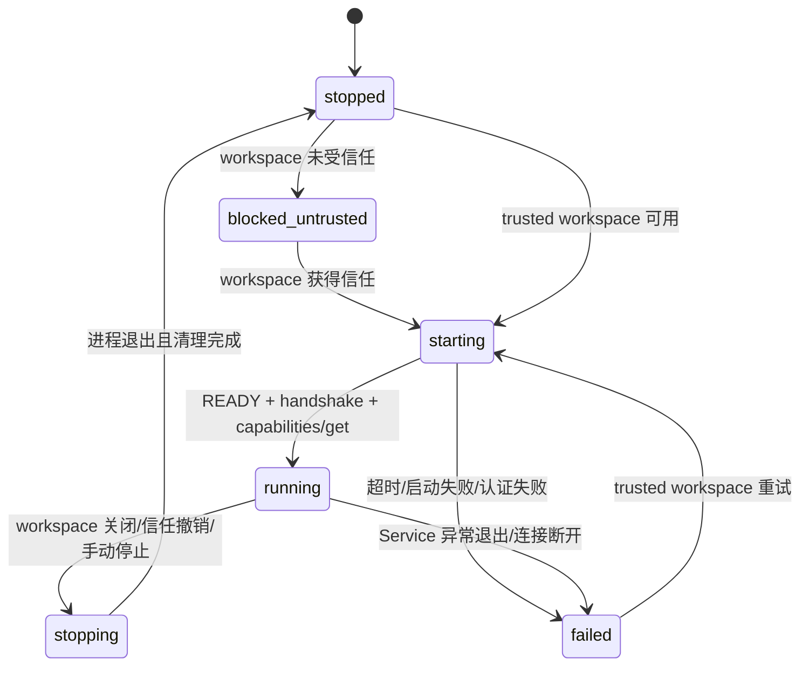

# Phase 6 Code-OSS Extension 首个 Vertical Slice 设计

## 1. 文档状态

- 状态：已确认设计，待 implementation plan
- 日期：2026-08-16
- 范围：Phase 6 首个 Vertical Slice
- 目标平台：Windows Named Pipe、Linux Unix Socket
- 产品形态：Code-OSS desktop 的独立 Extension Host 集成

本文档定义 Phase 6 的第一阶段实现边界。它先验证 Code-OSS Extension、Workspace Trust、Go Service lifecycle 和现有 Protocol Client 的闭环，不在本阶段 vendoring 完整 Code-OSS 源码，也不实现完整 Testing API UI。

## 2. 背景与目标

当前仓库已经具备：

- Go `unit-test-service`，支持 `--endpoint`、`--token-file`、`--data-dir`、`--workspace-root` 和 `--trusted-workspace`；
- Windows per-user Named Pipe 和 Linux owner-only Unix Socket；
- `READY <endpoint>` 启动就绪信号；
- token handshake、capabilities 查询和 Protocol v1.0 到 v1.4 negotiation；
- `@unit-test-ide/test-client`，封装连接、认证、请求响应、事件订阅和 schema validation；
- `tools/service-probe` 中已经验证过的 token preparation、启动等待、超时、退出和脱敏错误处理。

Phase 6 首个 Vertical Slice 的目标是把这些能力接入 Code-OSS Extension Host：

1. 在 trusted 单根 workspace 中启动并连接 Go Service；
2. 在 untrusted workspace 中硬性拒绝 Service 和执行入口；
3. 在 workspace 信任状态变化时正确管理 Service lifecycle；
4. 通过现有 `Protocol Client` 执行 `workspace/inspect`；
5. 为后续 Testing API、Build Profile、Target、Diagnostic 和 Coverage UI 保留稳定接口。

## 3. 非目标

本阶段不实现：

- 完整 Code-OSS 源码 fork 或 desktop installer；
- Code-OSS Testing API 的 test tree、test run profile 和结果装饰；
- CMake configure/build 业务逻辑；
- test discovery、test execution 和 coverage UI；
- Webview；
- 自定义协议编解码、schema 生成或第二套 IPC transport；
- 让 Extension 接受用户提供的 raw executable、raw args 或 environment 并透传到 Protocol。

## 4. 架构决策

### 4.1 采用独立 Extension Host

首个 Vertical Slice 采用独立 `Code-OSS Extension` package，通过 `Extension Development Host` 运行。它不修改 Code-OSS core，也不把完整 Code-OSS 源码放入本仓库。

后续 slim Code-OSS desktop 只需将同一个 Extension 注册为 built-in extension，并提供 bundled `unit-test-service`；Extension 与 Go Service 的边界不变。

```mermaid
flowchart LR
    UI[Code-OSS UI] --> EH[Extension Host]
    EH --> TG[Workspace Trust gate]
    TG --> SM[ServiceManager]
    SM --> PC[@unit-test-ide/test-client]
    PC --> IPC{Local IPC}
    IPC --> GS[Go unit-test-service]
    GS --> WS[Workspace / Build / Test domain]
```

### 4.2 目录布局

建议新增独立 package：

```text
apps/code-oss-extension/
├── package.json
├── tsconfig.json
├── src/
│   ├── extension.ts
│   ├── trust-gate.ts
│   ├── service-manager.ts
│   ├── protocol-client.ts
│   └── commands.ts
└── test/
    ├── trust-gate.test.ts
    └── service-manager.test.ts
```

职责边界：

| 模块 | 职责 |
| --- | --- |
| `extension.ts` | 注册 Extension、监听 workspace/trust 变化、协调 lifecycle |
| `trust-gate.ts` | 计算 workspace 是否允许执行，并拒绝 untrusted 操作 |
| `service-manager.ts` | 管理 token、endpoint、data directory、子进程、连接和清理 |
| `protocol-client.ts` | 适配 `@unit-test-ide/test-client`，不复制协议实现 |
| `commands.ts` | 注册首期命令和 Output Channel/状态栏反馈 |

Go Service 继续负责 workspace 检查、CMake、toolchain、task、test 和 coverage domain。Extension 不实现这些业务。

## 5. Workspace Trust gate

首个 Vertical Slice 支持单根 workspace：

- 没有 workspace：Service 保持 `stopped`；
- 多根 workspace：显示暂不支持 multi-root workspace，不启动 Service；
- 单根且 `workspace.isTrusted === false`：进入 `blocked-untrusted`，不创建 token、endpoint、data directory，不 spawn Go Service；
- 信任授予后：自动进入 `starting`；
- 信任撤销后：禁止新的 build/test 入口，优雅停止 Service，清理本次 session 资源，回到 `blocked-untrusted`。

Trust gate 是硬性安全边界，不允许通过命令参数、UI 或 Protocol payload 绕过。

## 6. Service lifecycle

### 6.1 状态机



### 6.2 启动顺序

`ServiceManager.start()` 必须按以下顺序执行：

1. 检查 `workspace.isTrusted`、workspace folder 数量和 Service executable 配置；
2. 创建 owner-only session directory；
3. 生成随机 token；
4. 调用 `unit-test-service --prepare-token-file <path>`；
5. 只向已创建的 token file 写入 token，不替换文件；
6. 生成平台 endpoint：Windows 使用 per-user Named Pipe，Linux 使用 owner-only Unix Socket；
7. 启动 Go Service，传入：
   - `--endpoint <endpoint>`
   - `--token-file <token-file>`
   - `--data-dir <data-dir>`
   - `--workspace-root <workspace-root>`
   - `--trusted-workspace=true`
8. 等待精确的 `READY <endpoint>`；
9. 通过 `@unit-test-ide/test-client` 建立连接并执行 token `handshake`；
10. 调用 `capabilities/get`，确认服务能力后才进入 `running`。

`ProtocolClient.connect(endpoint)` 继续使用现有 endpoint connector。Windows Named Pipe 和 Linux Unix Socket 的差异由 Node `net` 与 Go transport 层处理，Extension 不新增 transport abstraction。

### 6.3 停止、失败与重启

- `stop()` 必须幂等；
- 先停止接受新请求，再关闭 Protocol connection，再请求 Service 退出；
- 超时后强制终止子进程；
- endpoint、token file、session directory 的清理由 `ServiceManager` 统一负责；
- 启动任一步骤失败进入 `failed`，错误消息脱敏；
- 重启使用全新的 token、endpoint、client connection 和 session resource；
- Service 异常退出时不得自动复用旧 token 或旧 endpoint；
- stop/cleanup 不能把 token、完整环境变量、原始命令行或敏感绝对路径写入日志。

## 7. Extension manifest、配置与命令

### 7.1 Manifest

Extension 使用标准 `Code-OSS Extension` manifest：

- `extensionKind: ["workspace"]`；
- 首期 activation events 为 `onStartupFinished` 和 workspace folder 变化事件；
- 不修改 Code-OSS core；
- 后续 built-in registration 不改变 Service 或 Protocol contract。

### 7.2 配置

- `unitTestIde.serviceExecutable`
  - production 默认解析 Extension 安装目录中的 bundled `unit-test-service`；
  - 仅 development profile 允许覆盖；
  - 必须是绝对路径，失败信息只显示脱敏摘要。
- `unitTestIde.serviceStartupTimeoutMs`
  - 默认 10 秒；
  - 限制在预设安全范围内。
- `unitTestIde.autoStart`
  - 默认 `true`；
  - 只在 trusted 单根 workspace 生效。

### 7.3 首期命令与反馈

注册：

- `Unit Test: Start Service`；
- `Unit Test: Stop Service`；
- `Unit Test: Inspect Workspace`。

状态栏显示：

- `Unit Test: Untrusted Workspace`；
- `Unit Test: Starting Service`；
- `Unit Test: Service Ready`；
- `Unit Test: Service Failed`。

`Inspect Workspace` 只调用已有 `workspace/inspect`，结果写入专用 Output Channel。它不直接执行 CMake、build 或 test process。

## 8. Protocol 边界

Extension 只使用现有 `@unit-test-ide/test-client` API：

- `connect(endpoint)`；
- `handshake(token, clientName, clientVersion)`；
- `getCapabilities()`；
- `inspectWorkspace()`；
- 后续的 `listTargets`、test discovery、test run 和 coverage API 由后续子阶段接入。

Extension 不直接构造 JSON envelope，不调用 Go internal package，不把 executable、raw args、environment 或 cwd 作为用户可控 Protocol 字段发送。

## 9. 测试与验收

### 9.1 Trust gate unit tests

- untrusted workspace 不 spawn；
- trust transition 自动启动；
- revoke trust 停止 Service；
- multi-root workspace 被拒绝；
- no workspace 保持 `stopped`。

### 9.2 Service manager unit tests

- `--prepare-token-file`、READY、handshake、capabilities 顺序正确；
- timeout、异常退出、认证失败可恢复；
- stop/restart 幂等并生成新 token/endpoint；
- 输出和错误不泄露 token、环境变量和敏感路径；
- cleanup 在成功、启动失败、强制停止和信任撤销路径均执行。

### 9.3 Extension integration smoke

- trusted workspace 启动真实 Go Service；
- Windows Named Pipe 和 Linux Unix Socket 分别验证；
- `workspace/inspect` 成功；
- untrusted workspace 验证零 Service 进程、零 token、零 endpoint；
- Extension 可以在 `Extension Development Host` 激活。

完成标准：独立 Extension package 可构建并在 Extension Development Host 激活；trusted 单根 workspace 能连接真实 Go Service；untrusted workspace 完全拒绝执行；后续接入 slim Code-OSS 时无需修改 Go Service IPC 或 Protocol contract。

## 10. 风险与后续拆分

- 完整 Code-OSS fork、branding、update/telemetry 和 installer 放入后续 desktop packaging 子阶段；
- Testing API test tree、run profile、source decoration 和 coverage UI 放入后续 Phase 6/7 子阶段；
- 如果 `service-probe` 与 Extension 的启动逻辑出现重复，应在实现阶段抽取独立 shared launcher package，但不能让 Extension 依赖 probe-only package；
- Linux runtime/container smoke 继续由 Linux CI 提供，Windows 本地验证不替代 Linux evidence；
- Protocol schema 新增字段必须继续通过 generated model 和 compatibility gate。
